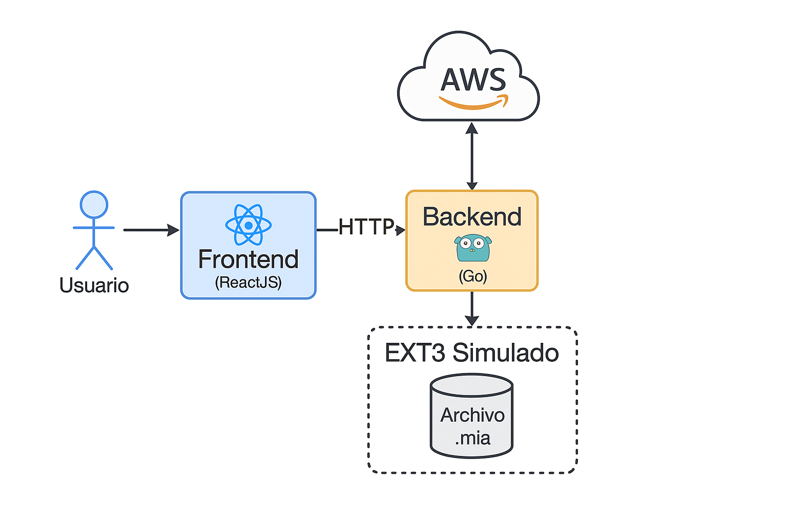
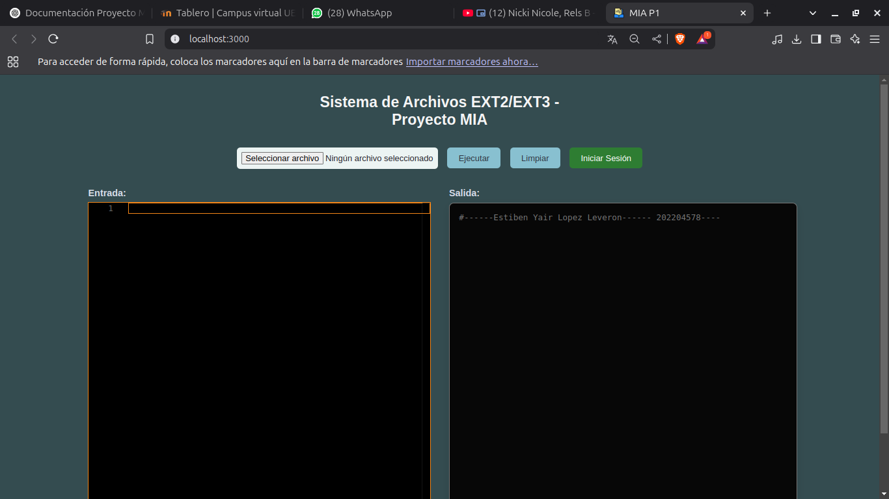

# Manual Técnico - Proyecto 2 MIA 1S 2025

## 1. Información General

**Nombre del estudiante:** Estiben Yair Lopez Leveron  
**Carné:** 202204578  
**Curso:** Manejo e Implementación de Archivos (MIA)  
**Semestre:** 1S 2025  

## 2. Descripción de la Arquitectura del Sistema

Este sistema se basa en una arquitectura cliente-servidor compuesta por los siguientes módulos, desplegados en la nube:

- **Frontend (ReactJS):** Interfaz gráfica desplegada en un bucket S3 de AWS. Permite a los usuarios enviar comandos, visualizar resultados, explorar gráficamente el sistema de archivos EXT3 y ver el journaling.
- **Backend (Go):** API RESTful desplegada en una instancia EC2 de AWS (Ubuntu). Recibe comandos desde el frontend, los interpreta y ejecuta sobre archivos binarios `.mia` que simulan discos virtuales EXT3. También maneja recuperación con journaling.

Ambos componentes se comunican mediante peticiones HTTP bajo un modelo REST.

### Diagrama de Arquitectura

### Backend en Go (API REST)

Desarrollado usando el framework Fiber. Expone un endpoint `/execute` que recibe comandos JSON:

```json
{
  "command": "mkdisk -size=10 -path=/ruta/disco.mia"
}
```

Flujo del backend:

1. Recibe el comando vía POST.
2. Lo interpreta mediante `Analyzer`.
3. Ejecuta la acción sobre el archivo `.mia` y devuelve la respuesta al frontend.

Corre en el puerto `3001` y usa CORS para aceptar peticiones del frontend.

### Frontend en React

Frontend desplegado en S3. Permite:

- Ingresar comandos.
- Iniciar y cerrar sesión.
- Visualizar el sistema de archivos en modo gráfico (solo lectura).
- Mostrar contenido de archivos y journaling.


## 3. Explicación de las Estructuras de Datos

### MBR (Master Boot Record)
Contiene metadatos del disco, incluidas hasta 4 particiones (primarias o extendida).

### EBR (Extended Boot Record)
Encabezado de particiones lógicas dentro de una partición extendida. Permite enlazar varias.

### Superbloque
Metadatos del sistema EXT3: conteo de inodos, bloques, bitmaps, journaling y punteros.

### Inodos
Representan archivos/carpetas. Contienen metadatos como tipo, permisos, fechas, y punteros a bloques.

### Bloques
- Folder Blocks: referencias a carpetas.
- File Blocks: referencias a archivos.
- Content Blocks: contenido de archivos.

EXT3 usa tres tipos de bloques. Se crean el triple de bloques que de inodos.

### Bitmaps
- Bitmap de inodos: indica qué inodos están ocupados.
- Bitmap de bloques: lo mismo para bloques.

### Journal
NUEVA estructura en EXT3. Guarda registros de operaciones realizadas: tipo, usuario, ruta, contenido, fecha/hora.

```go
type Journal struct {
  TipoOperacion string
  Path          string
  Contenido     string
  Fecha         string
  Usuario       string
}
```

## 4. Comandos Implementados

### `mkdisk`
Crea un disco con su MBR.

### `fdisk`
Crea particiones o elimina/agrega espacio con `-add` y `-delete`.

### `mount`
Monta una partición, asignando un ID único.

### `mkfs`
Formatea la partición como EXT3 o EXT2 (por defecto). Inicializa estructuras.

### `login`
Inicia sesión en una partición con un usuario válido (`users.txt`).

### `mkdir`
Crea carpetas dentro del sistema de archivos.

### `mkfile`
Crea archivos con contenido opcional.

### `cat`
Muestra el contenido de un archivo.

### `remove`
Elimina archivo o carpeta con permisos adecuados.

### `edit`
Modifica el contenido de un archivo.

### `rename`
Cambia el nombre de archivo o carpeta.

### `copy`
Copia una ruta y su contenido a otro destino.

### `move`
Mueve carpetas o archivos a otro destino dentro de la misma partición.

### `find`
Busca archivos/carpetas por nombre usando comodines.

### `chown`
Cambia el propietario de una ruta.

### `chmod`
Cambia permisos de una ruta (`ugo`).

### `unmount`
Desmonta una partición del sistema.

### `journaling`
Muestra el journal visualmente (no en archivo `.dot`).

### `recovery`
Reconstruye el sistema a partir del journal tras pérdida simulada.

### `loss`
Simula pérdida limpiando bitmaps, bloques e inodos.


## 5. Visualización Web del Sistema de Archivos

### `mkdisk`
- **Uso:**
  ```
  mkdisk -size=10 -path=/ruta/disco.mia
  ```
- **Descripción:** Crea un disco virtual y un MBR inicial.

### `fdisk`
- **Uso:**
  ```
  fdisk -size=3 -path=/ruta/disco.mia -name=part1
  ```
- **Descripción:** Crea una partición primaria, extendida o lógica dentro del disco.

### `mount`
- **Uso:**
  ```
  mount -path=/ruta/disco.mia -name=part1
  ```
- **Descripción:** Monta una partición y le asigna un ID único en memoria.

### `mkfs`
- **Uso:**
  ```
  mkfs -id=ID -type=full
  ```
- **Descripción:** Formatea la partición montada como EXT2 e inicializa superbloque, bitmaps, tablas e inodos. Crea el archivo inicial `users.txt`.

### `login`
- **Uso:**
  ```
  login -user=root -pass=123 -id=ID
  ```
- **Descripción:** Autentica usuarios con base en el archivo `users.txt`.

(Otros comandos como `mkdir`, `mkfile`, `cat`, `mkgrp`, `mkusr`, `rep`, etc., serán documentados conforme se implementen.)


## 6. Visualización Web del Sistema de Archivos

- Vista de selección de disco y partición.
- Visualizador gráfico (solo lectura) de carpetas y archivos.
- Vista de contenido de archivos `.txt`.
- Visualizador de journaling en interfaz.

## 7. Pruebas de Pérdida y Recuperación

### Simulación con `loss`
Se limpian bloques, inodos y bitmaps de la partición.

### Recuperación con `recovery`
Se restauran datos según el journal y el superbloque.

### Validación
Pruebas realizadas: estructura de carpetas recuperada, archivos restaurados.

## 8. Despliegue en AWS

### Frontend (ReactJS)
- Construido con `npm run build`
- Subido a bucket S3 con política pública
- Configurado para servir `index.html` como página de inicio

### Backend (Go)
- Desplegado en instancia EC2 (Ubuntu Server)
- Backend ejecutado manualmente con `go run main.go` o como servicio
- Puerto `3001` habilitado en Security Group
- Comunicación permitida desde origen cruzado (CORS)

---


## 9. Conclusión

Este sistema extiende el simulador EXT2 hacia EXT3 con manejo realista de bitácoras, recuperación ante fallos y visualización web. El despliegue en AWS permitió experimentar un ambiente real de servicios distribuidos, integración de frontend-backend y persistencia de datos binarios.
